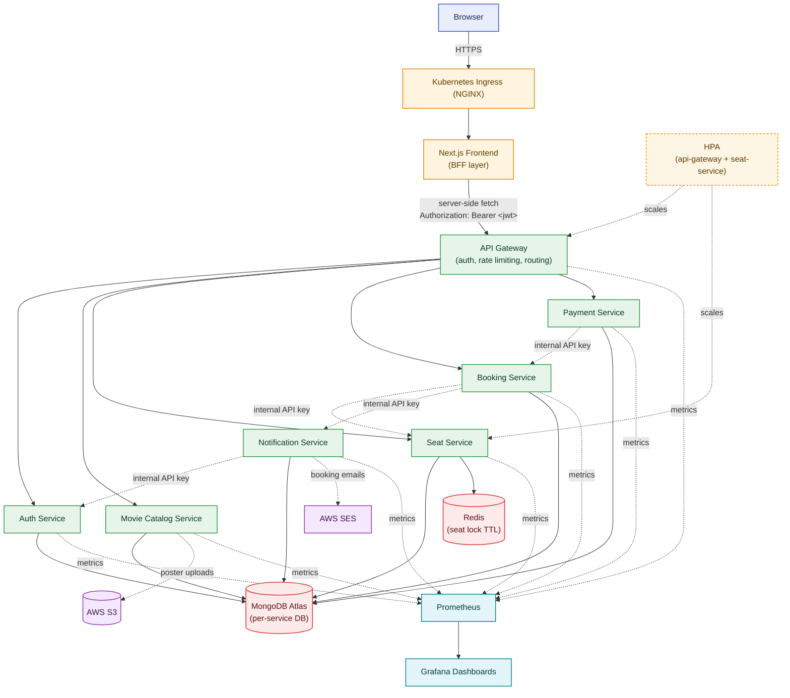

# service-O — Microservices Movie Booking Platform

A full-stack movie ticket booking platform built as an independent, production-style microservices system — six backend services behind an API gateway, a Next.js frontend acting as a BFF, Redis-backed seat locking, and a complete Docker → Kubernetes → CI/CD pipeline.

Built as a hands-on backend + DevOps learning project: every piece (auth, seat concurrency, payments, autoscaling, monitoring, CI/CD) is wired end-to-end and actually runs, not just scaffolded.

---

## Architecture



🟦 Client &nbsp; 🟧 Edge / entry &nbsp; 🟩 Application services &nbsp; 🟥 Data stores &nbsp; 🟪 External cloud services &nbsp; 🟦 Observability &nbsp; 🟨 Autoscaling

**Why a BFF (Backend-For-Frontend)?** The Next.js app never exposes the gateway or a raw JWT to the browser. Login/register/booking routes are Next.js API routes that read an `httpOnly` cookie server-side and forward requests to the gateway with the `Authorization` header attached — the token is never readable by client-side JavaScript.

**Why per-service internal routes?** Every service exposes both a public route set (behind the gateway, user-facing JWT auth) and an `/internal/*` route set (behind a shared internal API key, service-to-service only). Booking confirmation, seat release, and notification triggers all go through `/internal/*` so a compromised public endpoint can't be used to forge internal state changes.

---

## Services

| Service | Port | Responsibility | Data Store |
|---|---|---|---|
| `api-gateway` | 8000 | Single entry point, JWT verification, rate limiting, request proxying | — |
| `auth-service` | 5000 | Registration, login, JWT issuance, user roles | MongoDB |
| `movie-catalog` | 5001 | Movies, theatres, screens, shows, poster uploads | MongoDB + S3 |
| `seat-service` | 5002 | Seat inventory, Redis-backed locking during checkout | MongoDB + Redis |
| `booking-service` | 5003 | Booking lifecycle, seat-hold expiry cron job | MongoDB |
| `payment-service` | 5004 | Payment processing (simulated gateway), refunds | MongoDB |
| `notification-service` | 5005 | Booking-confirmation emails | MongoDB + AWS SES |
| `movie-frontend` | 3000 | Next.js UI + BFF API routes | — |

---

## Backend Design Highlights

A few implementation details worth calling out beyond "it's a REST API":

**API Gateway as the single trust boundary**
The gateway is the only service exposed with public routes for auth-required traffic. It verifies the JWT, then **strips any client-supplied `x-user-id` / `x-user-role` headers before re-setting them from the verified token** — this closes a header-spoofing gap where a client could otherwise forge identity by just sending those headers directly. Public GET routes (browsing movies/shows/seats) use an *optional* auth middleware so anonymous users can browse, but any write attempt downstream still 401s since there's no verified identity header. Every request also gets a `request-id` (generated or forwarded) that's logged and returned in the response, for tracing a single request across services.

**Redis-backed seat locking (the concurrency-critical part)**
Seat selection is a classic race condition — two users can't be allowed to lock the same seat. Locking uses a **Lua script executed atomically in Redis** (`EVAL`) that checks *all* requested seats are free before locking *any* of them — an all-or-nothing acquire, not a per-seat loop that could partially succeed. Lock TTL (10 minutes) matches the booking's `expiresAt`, so if a user abandons checkout, Redis auto-expires the lock without needing a separate cleanup job. On every seat read, expired-but-still-`LOCKED`-in-Mongo seats are reconciled back to `AVAILABLE` by checking Redis directly — so stale state never silently persists.

**Booking lifecycle via cron + internal routes**
A `node-cron` job runs every minute marking `PENDING` bookings older than their `expiresAt` as `EXPIRED`. Booking confirmation and cancellation aren't public endpoints — they live under `/internal/bookings/*`, callable only by other services (payment-service, notification-service) authenticated with a shared internal API key, distinct from user-facing JWTs. This means even if a user's token were compromised, they still couldn't directly call "confirm my own booking" — that transition only happens as a side effect of a real payment.

**Server-computed pricing, never trusted from the client**
`payment-service` never accepts an `amount` from the request body — it fetches the real booking from `booking-service` and uses *that* total. Same pattern in `booking-service`: seat prices come from `seat-service`'s live data at booking time, not whatever the client claims a seat costs.

**Validation and error handling**
Every route validates input with **Zod schemas** before touching the database — invalid payloads return structured 400s with field-level errors rather than leaking a raw Mongoose stack trace. A shared `AppError` class carries an intentional HTTP status code through the codebase so error middleware can respond correctly without guessing.

**Metrics baked into every service**
Each service exposes its own `/metrics` endpoint via `prom-client`, with a custom `http_requests_total` counter and `http_request_duration_seconds` histogram (labeled by method/route/status), plus Node's default process metrics (memory, event loop lag, GC) for free. Route labels use `req.route.path` (e.g. `/api/movies/:id`), not the raw URL, so per-ID traffic doesn't explode Prometheus's label cardinality.

**File uploads and email, done server-side only**
Movie posters upload directly to S3 via `multer-s3` — the poster URL is never accepted as client input on create/update, only ever set from the actual uploaded file. Booking-confirmation emails go out through AWS SES from `notification-service`, triggered internally by `booking-service` after a successful payment; a failed email is logged but never fails the booking itself, since the booking already succeeded and shouldn't roll back over a notification hiccup.


**Backend:** Node.js, Express, MongoDB (Mongoose), Redis, Zod validation, JWT
**Frontend:** Next.js (App Router), TypeScript, Tailwind, Framer Motion
**Infrastructure:** Docker, Docker Compose, Kubernetes (Minikube), Kustomize (dev/test/prod overlays)
**CI/CD:** Jenkins, GitHub webhooks, declarative Jenkinsfile with a manual production-approval gate
**Observability:** Prometheus, Grafana, `prom-client` custom metrics per service
**Cloud:** AWS S3 (poster storage), AWS SES (transactional email)

---

## CI/CD Pipeline

```mermaid
flowchart LR
    Dev["git push"] -->|webhook| GitHub["GitHub"]
    GitHub -->|triggers| Jenkins["Jenkins Pipeline"]
    Jenkins --> Build["Build 8 Docker images"]
    Build --> DDev["Deploy → dev"]
    DDev --> DTest["Deploy → test"]
    DTest --> Gate{{"Manual approval"}}
    Gate -->|approved| DProd["Deploy → prod"]

    classDef source fill:#e8eefc,stroke:#3b5bdb,stroke-width:1.5px,color:#1c2a4a
    classDef ci fill:#fff4e0,stroke:#e8890c,stroke-width:1.5px,color:#5c3d00
    classDef deploy fill:#e6f4ea,stroke:#2f9e44,stroke-width:1.5px,color:#0b3d1f
    classDef prodDeploy fill:#fdeaea,stroke:#e03131,stroke-width:1.5px,color:#5c1414
    classDef gate fill:#fef6e4,stroke:#f08c00,stroke-width:1.5px,color:#5c3d00,stroke-dasharray: 4 3

    class Dev,GitHub source
    class Jenkins,Build ci
    class DDev,DTest deploy
    class Gate gate
    class DProd prodDeploy
```



Every push to `main` automatically builds all 8 service images and deploys to `dev` and `test` namespaces. Production deploys require a manual click in the Jenkins UI — dev/test are safe to auto-deploy, prod isn't.

Each environment (`dev` / `test` / `prod`) is a fully isolated Kubernetes namespace with its own Ingress host, its own Secrets, and its own replica counts, all generated from one shared base via Kustomize overlays — not copy-pasted manifests.

---

## Kubernetes & Autoscaling

- Every service runs as its own Deployment + ClusterIP Service, with liveness/readiness probes on `/health`
- `api-gateway` and `seat-service` have `HorizontalPodAutoscaler`s tracking CPU utilization
- Load-tested with [k6](https://k6.io): under moderate sustained load, both HPAs scale cleanly (1 → 5 replicas) with **0% request failure**
- Under heavier load (200 concurrent VUs), testing surfaced a real capacity ceiling: the single-node Minikube cluster's total CPU (4 cores) became the bottleneck, not the application — a useful finding on the difference between *application-level* autoscaling and *cluster-level* capacity planning

---

## Getting Started (local, Minikube)

```bash
# 1. Start Minikube
minikube start --cpus=4 --memory=6144 --driver=docker
minikube addons enable ingress
minikube addons enable metrics-server

# 2. Point Docker at Minikube's daemon
minikube docker-env | Invoke-Expression   # PowerShell

# 3. Build all images
docker build -t auth-service:local ./auth-service
docker build -t movie-catalog:local ./movie-catalog
docker build -t seat-service:local ./seat-service
docker build -t booking-service:local ./booking-service
docker build -t payment-service:local ./payment-service
docker build -t notification-service:local ./notification-service
docker build -t api-gateway:local ./api-gateway
docker build -t frontend:local ./movie-frontend --build-arg NEXT_PUBLIC_API_URL=http://service-o.local:8080

# 4. Create namespace + secrets (see .env.example in each service)
kubectl create namespace dev
kubectl create secret generic auth-service-secret -n dev --from-literal=MONGO_URI="..." --from-literal=JWT_SECRET="..." --from-literal=INTERNAL_API_KEY="..."
# ...repeat per service, see RUNBOOK.md for the full list

# 5. Deploy
kubectl apply -k k8s/overlays/dev

# 6. Expose it locally
kubectl port-forward -n ingress-nginx svc/ingress-nginx-controller 8080:80
# add "127.0.0.1  service-o.local" to your hosts file, then visit:
# http://service-o.local:8080
```

Full command reference (all three environments, secret generation, Jenkins setup) is in [`RUNBOOK.md`](./RUNBOOK.md).

---

## Project Structure

```
service-O/
├── api-gateway/            # Reverse proxy, JWT auth, rate limiting
├── auth-service/           # Registration, login, user management
├── movie-catalog/          # Movies, theatres, screens, shows
├── seat-service/           # Seat inventory + Redis locking
├── booking-service/        # Booking lifecycle + expiry job
├── payment-service/        # Payment processing
├── notification-service/   # Email notifications (AWS SES)
├── movie-frontend/         # Next.js frontend + BFF API routes
├── k8s/
│   ├── base/                # Shared manifests (Deployments, Services, ConfigMaps)
│   └── overlays/
│       ├── dev/
│       ├── test/
│       └── prod/            # Kustomize per-environment patches
├── Jenkinsfile             # CI/CD pipeline definition
├── docker-compose.yaml     # Local multi-container dev environment
├── prometheus.yml          # Metrics scrape config
└── load-test.js            # k6 load test script
```

---

## Security Notes

- JWTs are signed with a rotated, high-entropy secret (never the placeholder default) and never touch client-side JavaScript
- Internal service-to-service routes are gated behind a separate internal API key, distinct from user-facing JWT auth
- All backend Services are `ClusterIP`-only — only the gateway and frontend are reachable from outside the cluster
- Secrets are managed via Kubernetes `Secret` objects, generated per-environment, never committed to git
- `.env` files are git-ignored across every service; only `.env.example` templates are tracked

---

## Author

Shreyansh Sinha — built as an independent project to learn production-grade backend architecture and DevOps practices end-to-end.
